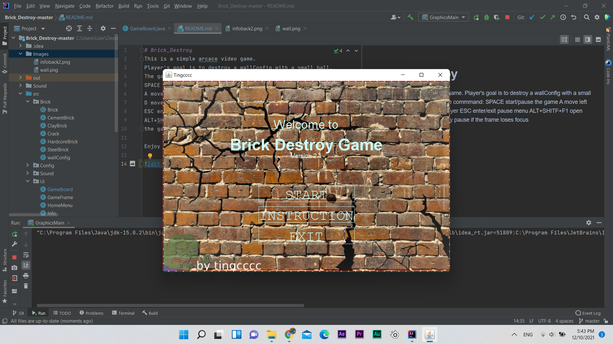
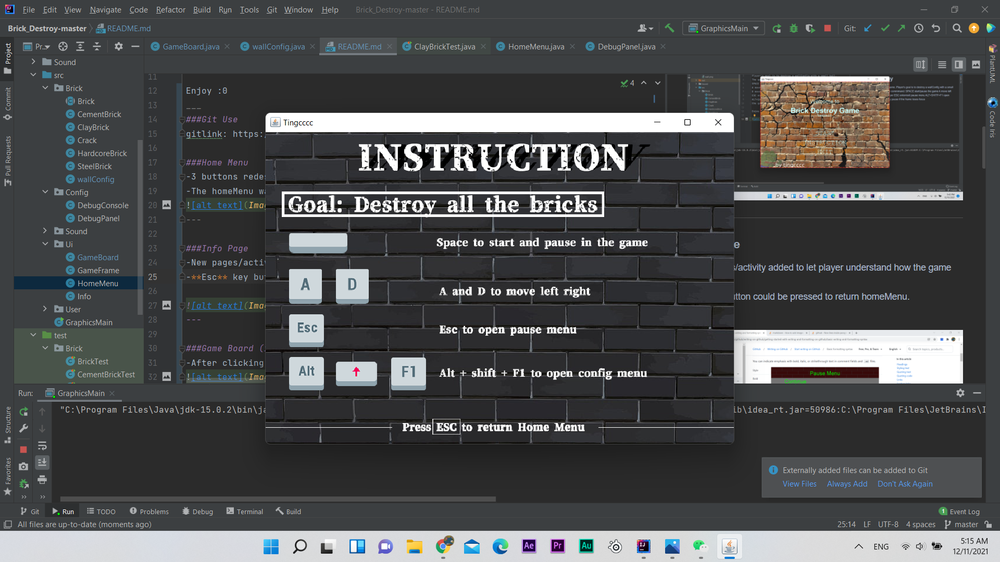
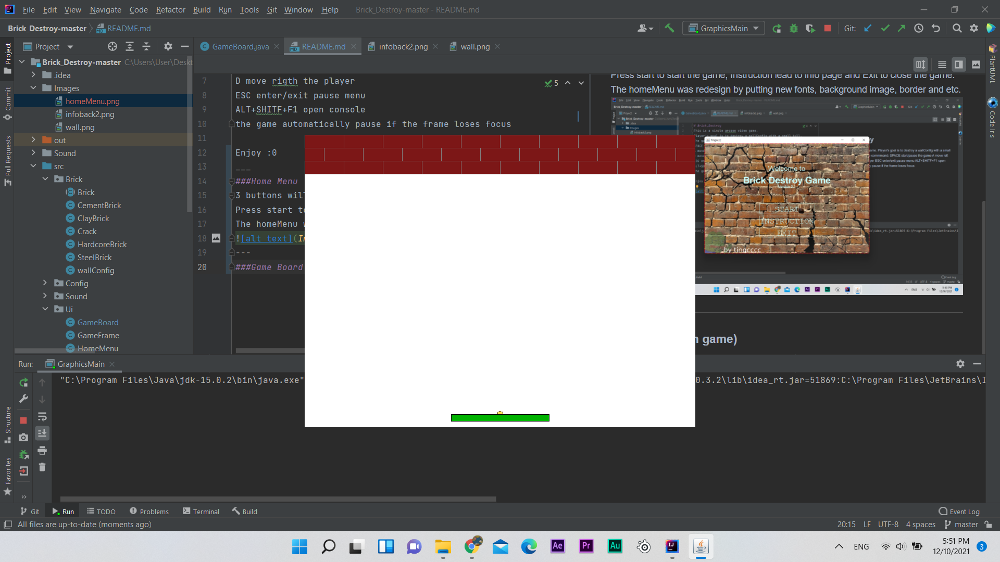
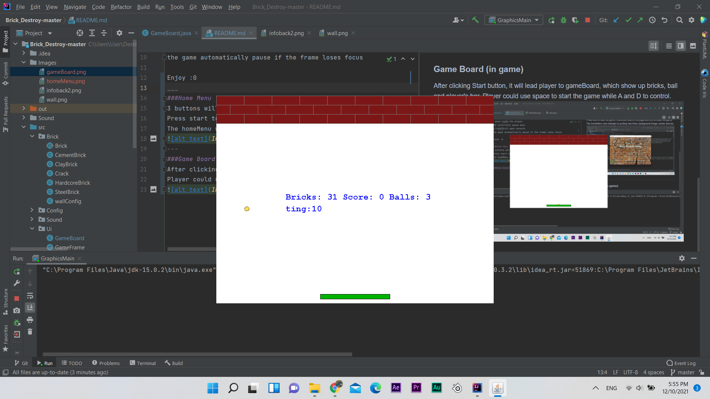
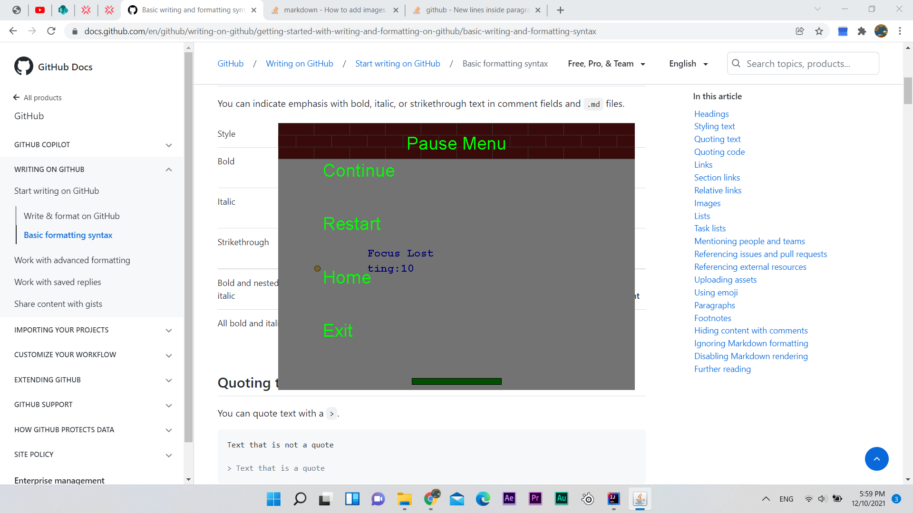
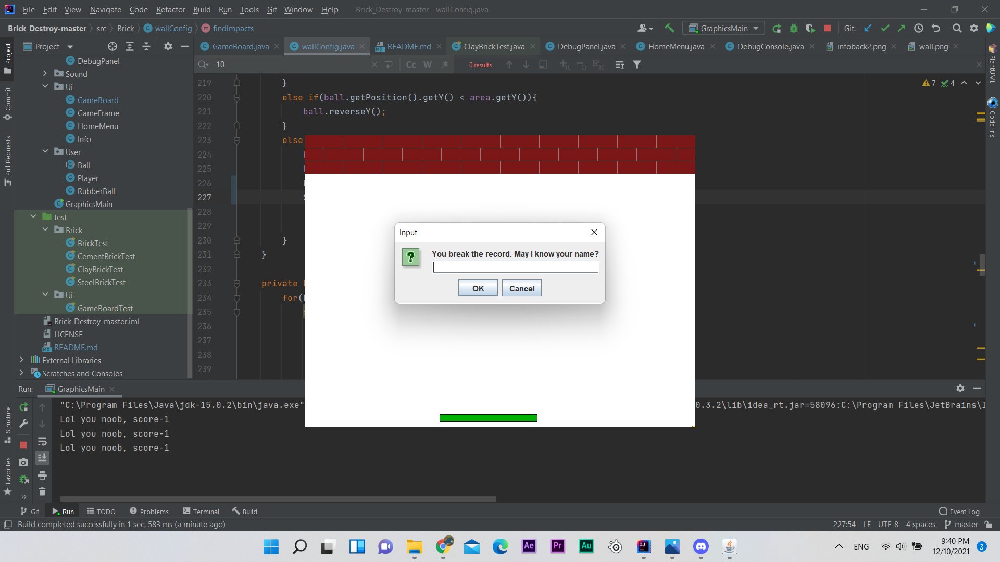

# Brick_Destroy
This is a simple arcade video game.
Player's goal is to destroy a all the bricks with a small ball.
The game has very simple command:  
SPACE start/pause the game  
A move left the player  
D move right the player  
ESC enter/exit pause menu  
ALT+SHIFT+F1 open console  
The game automatically pause if the frame loses focus
Enjoy :0
___
###Version Control   
Github been used for commit and push.   
gitlink: https://github.com/ting0608/COMP2042_CW_TingChungCheng

---
#What Changed?
###Home Menu
-3 buttons redesign on homeMenu, which is Start, Instruction and Exit.  
-The homeMenu was redesign by putting new fonts, background image, border and etc.

---

###Info Page
-New pages/activity added to let player understand how the game works   
-**Esc** key button could be pressed to return homeMenu.

---

###Game Board (in game)
-After clicking Start button, it will lead player to gameBoard, which show up bricks, ball and player's bar.

---

###Game Board (start game)
-Player press space to start the game, the ball start bouncing off from the bar.   
-More game details added, such as Bricks, Score, Balls, and Highscore.   
-Sfx(sound effects) will be play when bricks broken.

---

###Pause Menu
-Allow player could always press esc while still in game to pause. 
It will show the pauseMenu which contains _continue, restart, home and exit_.  
-**Home** button added to return homeMenu.  
 

---

###HighScore
If player break the record and reach game over, the game will pop a dialog and ask player to fill in their name.
After that, the highscore showing in the middle of game will be replaced.

---
#Refactoring
###<ins>1. Breaking packages</ins>
-Several packages have been reorganized for better and easier management.
For example, classes been divided into big packages call Brick, Config, Sound, User and Ui.   
-This could help programmer to find and search the relevant classes easily.  

###<ins>2. Basic maintenance</ins>
-Some classes have been renamed due to their non-meaningful naming. For example wall renamed into wallConfig, since that class not only contain methods for brick's wall.  

###<ins>3. Methods breaking</ins>
-Some 'God method' which mean those methods which are heavy and replicant have been divided into several spread methods.   
-For example: repaint code appear several times for different button in HomeMenu, hence 3 different repaint been declare for each button's painting.  
-Methods example RepaintStart(), RepaintInfo(), RepaintMenu(), draw() and etc

###<ins>4. Moving classes</ins>
-Some inner classes been moved to upper classes.   
-Example: Crack class refactor from brick class's inner class to upper class.  
-Easier for future maintenance.

###<ins>5. Meaningful junit test</ins>
-Some junit test been build, mostly around bricks score and highscore.   
-For example:Use assertEquals to ensure that score gain as expected when the bricks broken.

###<ins>6. Removed unused import/resources</ins>
-Some libraries/import been removed due to their non-usage

---
#Rewards and penalty
-Reward: if player pass level with full health(3 balls), score*2.  
-Penalty: if player lose 1 ball, score-5.

---
#Javadocs
-Javadocs added for almost 80% of the classes(only those I feel necessary)  
-Majority is about explaining what is this param and what those methods do.